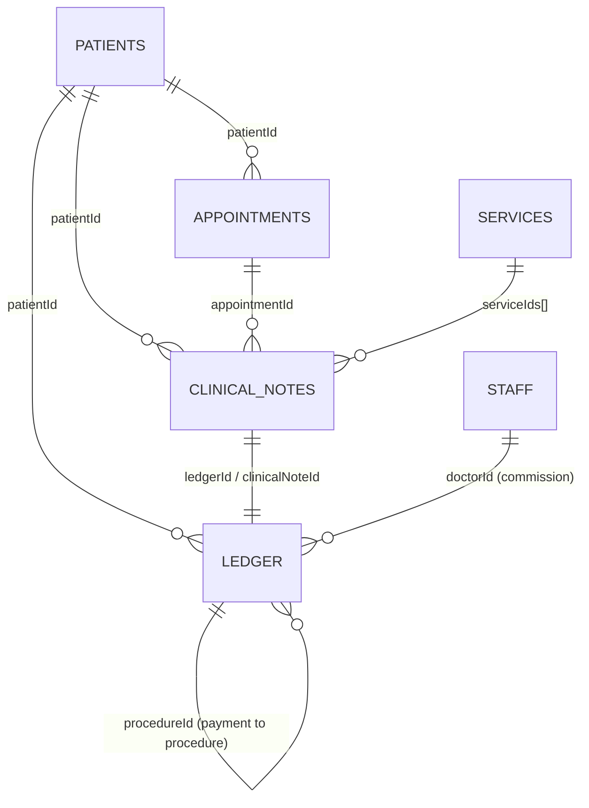
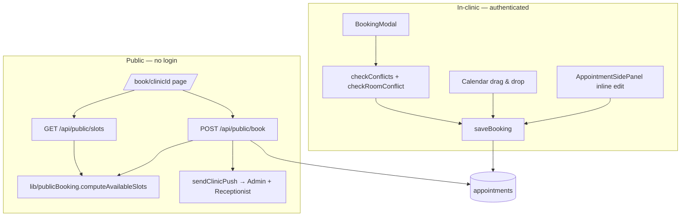
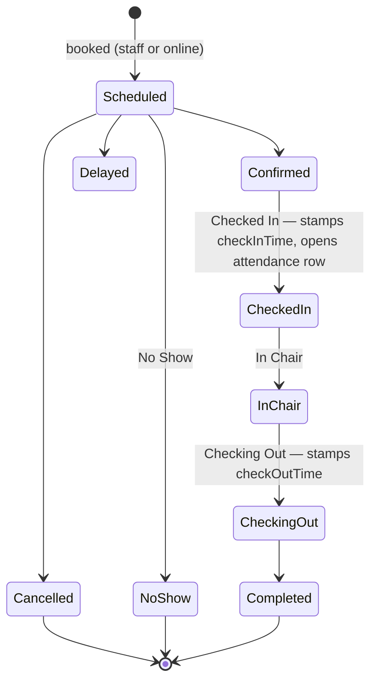
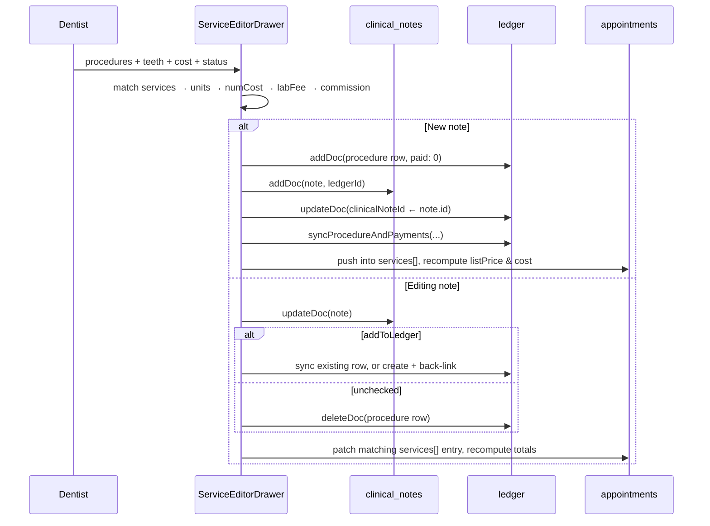
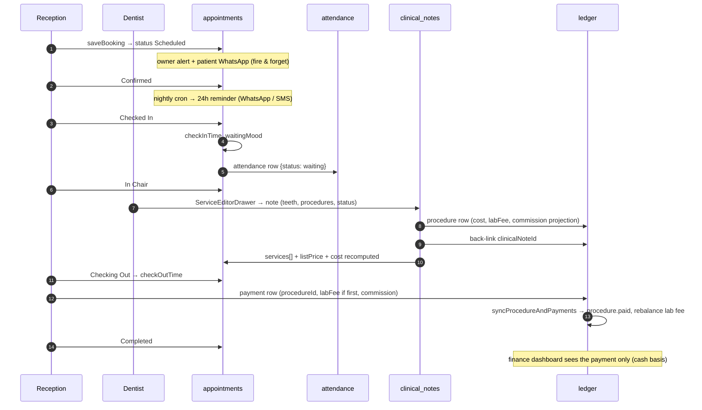

# Blueprint — Booking, Clinical Notes, Ledger & Finance

How the four money-and-care domains of Alpha V3 actually work: the documents they write, the
order they write them in, the invariants that hold them together, and the places where those
invariants are only held by convention.

Derived by reading the code on `claude/booking-clinical-finance-blueprint-oylayc`. Every claim
below is anchored to a file and line so it can be re-checked when the code moves.

---

## 1. Ground rules the four domains share

### 1.1 Everything is a per-clinic subcollection

There is no root `appointments`, `ledger`, `clinical_notes`, or `patients` collection. All four
live under `clinics/{clinicId}/…`. Two helpers enforce that path so it is correct by construction
rather than by memory:

| Side | Helper | File |
|---|---|---|
| Browser | `getClinicCollection(path)` / `getClinicDoc(path, id)` | `src/lib/db-utils.ts:27` |
| Server | `adminClinicCollection(clinicId, path)` / `adminClinicDoc(...)` | `src/lib/adminClinicDb.ts:35` |

Only `users`, `clinics`, `join_requests` and `clinic_secrets` are genuinely global
(`src/lib/adminClinicDb.ts:18`). The client helper's global list is shorter — it does **not**
include `clinic_secrets` — because the browser never touches secrets at all.

The browser helper reads a module-level `globalClinicId` set by the clinic provider and **throws**
if unset (`src/lib/db-utils.ts:11`). The server helper refuses to fall back to a root collection
when `clinicId` is missing (`src/lib/adminClinicDb.ts:28`) — a deliberate hard failure, because
the silent alternative is reading or writing the wrong tenant.

### 1.2 Authorisation is two-layered

**Firestore rules** (`firestore.rules`) grant read/write on `clinics/{clinicId}/{subcollection}/**`
to any user holding a role in that clinic, provided the clinic's `status == "Active"`. `ledger`,
`appointments` and `clinical_notes` all fall under that blanket grant — there is no rule-level
distinction between a receptionist and a dentist for money or clinical records.

The rules file carries a load-bearing warning worth repeating: Firestore rules **OR** together, so
a narrower `allow write` in a more specific block can only ever *add* permission. Restricted
subcollections (`staff`, `settings`, `system_logs`, `leads`, `sms_outbox`, …) are therefore
explicitly *excluded* from the blanket grant by name, not merely overridden below it.

**Application permissions** are the real granularity, and they are enforced only in the UI:

```
access.finance    access.appointments   access.clinical
finance.add       appointments.add      clinical.edit
finance.edit      appointments.edit     clinical.delete
finance.delete    appointments.delete
```

Catalogue at `src/config/permissionsCatalog.ts`; consumed as e.g.
`isAdmin || user?.permissions?.includes("finance.edit")` (`src/components/PatientFinance.tsx:139`).

> **Consequence:** a user with any clinic role can write any ledger row directly through the
> Firestore SDK. `finance.delete` hides a button; it does not stop a write.

### 1.3 Two canonical string formats, used as join keys

Dates and times are stored as strings and compared as strings, so their normalisation is a
correctness concern, not cosmetics (`src/lib/appointmentTime.ts`):

- **Date** — `YYYY-MM-DD` (`normalizeDateKey`). Used in range queries (`where("date", ">=", …)`)
  in finance, appointments and attendance, all of which rely on lexicographic ordering.
- **Time** — `hh:mm AM/PM`, zero-padded (`normalizeTimeKey`). Accepts 24-hour input and the
  Arabic ص/م markers.
- **Overlap** is *never* decided on the strings — always via `parseApptTimeToMinutes` →
  minutes-from-midnight.

These functions live in a Firebase-free module specifically so server routes can use them without
pulling in the browser SDK. The public booking endpoint previously hand-rolled `"14:00"` while the
clinic app stored `"02:00 PM"`, so a filled slot still looked free online.

---

## 2. The data model



### 2.1 `appointments`

The visit itself: who, when, with whom, where, and what stage it is at.

| Field | Notes |
|---|---|
| `patientId`, `patientName` | Name denormalised for display and search |
| `date`, `time`, `duration` | Canonical formats; `duration` in minutes, default 30 |
| `doctor`, `doctorId` | `doctor` is a **display string** and not stable — it has held an email address in real records. `doctorId` was added as the stable grouping key (`src/lib/bookingService.ts:37`) |
| `branchId/branchName`, `roomId/roomName` | Ids are the keys, names are display copies |
| `status`, `statusHistory[]` | See §3.3. History is append-only via `arrayUnion` |
| `checkInTime`, `checkOutTime`, `waitingMood` | Stamped by stage transitions |
| `cost`, `listPrice`, `discountMode/Percent/Fixed/Amount` | Appointment-level pricing — largely vestigial, see §6.1 |
| `services[]` | Denormalised mirror of the visit's clinical notes, written back by the note editor |
| `clinicalNoteId` | Legacy single-note link |
| `source`, `sourceTag`, `patientPhone` | Written only by the public booking endpoint |
| `rescheduledFromId/ToId` + dates | Written only by the AI reschedule path |

### 2.2 `clinical_notes`

One document per **procedure performed or planned**, not one per visit. This is the unit of
clinical record *and* the unit that generates a charge.

| Field | Notes |
|---|---|
| `patientId`, `appointmentId` | `appointmentId` may be null — a "general" note not tied to a visit |
| `tooth` | Comma-joined FDI codes, or the literal `"Gen"` |
| `procedure`, `procedures[]` | `procedure` is the display join (`"A + B"`); `procedures[]` is the list |
| `serviceIds[]`, `serviceId`, `serviceName` | Price-list entries the free text resolved to |
| `unmatchedProcedures[]` | Names that matched nothing — recorded so reports can *disclose* what they could not classify rather than silently undercount |
| `cost`, `unitCost`, `unitsCount`, `pricingFormula`, `pricingMode` | The full pricing derivation, kept so a re-save never silently moves the total |
| `doctor`, `doctorId` | The **treating** dentist — who gets paid |
| `createdByUid/Name/Role`, `updatedBy…` | The **author** — who typed it. Deliberately separate from the treating dentist |
| `status` | `Planned` / `Ongoing` / `Completed` |
| `ledgerId` | Link to the procedure ledger row, or null if not billed |
| `sortIndex` | Manual timeline position — stored on the note, not per-user, because a hand-arranged treatment sequence is clinical information the whole clinic must see identically (`src/components/clinical-notes/types.ts:37`) |
| `isContinued`, `continuedFromName` | Set by "continue in another visit" |

Notably, `clinical_notes` documents **never store `patientName`** in this app — only `patientId`.
Anything that needs a name must join through `patients` (`src/lib/revenueRecovery.ts:109`).

### 2.3 `ledger` — one collection, four row types

This is the single most important thing to understand about the finance side. `ledger` is not a
double-entry journal; it is a flat collection of rows discriminated by `type`:

| `type` | Meaning | Money field | Written by |
|---|---|---|---|
| `procedure` | A charge raised against a patient (accounts receivable) | `cost` (`amount` mirrors it) | Note editor, booking, side panel |
| `payment` | Cash actually collected | `paid` (`amount` usually mirrors it) | Patient finance, quick payment, side panel, AI |
| `expense` | Clinic overhead | `cost` | Finance page manual entry |
| `income` | Non-patient income | `paid` | Finance page manual entry |

A `payment` links to the charge it settles via `procedureId`. A null `procedureId` is an
unallocated / advance payment.

**The `amount` vs `paid` trap.** Some write paths store the real value in `paid` and leave
`amount: 0` as a placeholder. `row.amount ?? row.paid` is therefore *wrong* — `??` only falls
through on null/undefined, and `0` is neither. The canonical resolver is:

```ts
// src/lib/revenueRecovery.ts:96
rowAmount(row) = row.type === "payment"
  ? Number(row.paid ?? row.amount)   // payments resolve through `paid` first
  : Number(row.amount ?? row.cost);  // procedures through `amount`/`cost` first
```

Other shared fields on money rows: `date`, `description`, `category`, `method`, `doctorId`,
`doctorName`, `doctorCommissionPercentage`, `doctorCommissionAmount`, `labFee`, `clinicProfit`,
`clinicalNoteId`, `appointmentId`, `addedBy` / `receivedBy` / `createdBy`.

### 2.4 Settings documents that drive these domains

All under `clinics/{clinicId}/settings/{docId}`:

| Doc | Drives |
|---|---|
| `clinic_info` | `schedule` (start/end/slotDuration/offDays) — the calendar grid and every availability calculation |
| `onlineBooking` | `enabled`, `enableDoctorSelection`, `defaultDurationMinutes` |
| `visit_reasons` | Reason list, validated server-side on public bookings |
| `patient_sources` | Referral source options |
| `locations` | Branches and rooms |
| `counters` | `patientId` sequence for `PT-####` file ids |

`parseClinicSchedule` (`src/lib/clinicSchedule.ts:33`) returns an `isConfigured` flag alongside the
values. Nothing seeds `clinic_info` at onboarding, so an unconfigured clinic parses as
"09:00–21:00, seven days a week" — the flag is what lets callers say *"not configured"* instead of
confidently suggesting a Friday evening slot to a clinic that closes at five.

---

## 3. Booking

### 3.1 The two front doors



The two doors do **not** share their availability logic, and they behave differently on purpose.

### 3.2 Availability: three different engines

| Engine | File | Used by | Behaviour |
|---|---|---|---|
| `computeAvailableSlots` | `src/lib/publicBooking.ts:128` | Public slots + public book | Authoritative. Enforces hours, off-days, per-dentist and per-branch busy sets, each appointment's own duration, and "not in the past". Returns free times only — never the appointments behind them |
| `checkConflicts` / `checkRoomConflict` | `src/components/BookingModal.tsx:522` / `:554` | Staff booking modal | **Advisory.** Detects overlap, then asks "proceed anyway?" — staff can always double-book |
| `suggestSlots` | `src/lib/automation/slotSuggestions.ts` (via `POST /api/appointments/free-slots`) | Treatment-plan scheduling, AI assistant | Walks forward up to 30 days, returns days-with-times |

Key differences to keep in mind:

- Public treats `Cancelled` and `No Show` as **releasing** the slot (`RELEASED_STATUSES`,
  `src/lib/publicBooking.ts:25`); the staff modal only skips `cancelled`/`canceled`.
- Public filters busy appointments by *branch* and by *dentist name*; with no dentist chosen,
  **any** booking blocks the slot — one chair is the working assumption.
- An appointment with no `branchId` (pre-branches data) blocks **every** branch. That is the safe
  direction, deliberately chosen.
- Staff conflict checks query `where("doctor", "==", …)` on the display string, so renaming a
  dentist breaks conflict detection for their existing appointments.

### 3.3 The appointment lifecycle



Canonical values live in `APPOINTMENT_STAGES` (`src/lib/appointmentStages.ts:2`). Three legacy
values are still readable through an alias map rather than a migration:

| Stored | Means | Why it existed |
|---|---|---|
| `Arrived` | `Checked In` | Old dashboard one-click button |
| `Seated` | `In Chair` | Old dashboard one-click button |
| `Pending` | `Scheduled` | Old public booking endpoint |

This matters because the side effects key off the **exact** string `"Checked In"`. An appointment
stored as `Arrived` got no `checkInTime` and no attendance row — invisible to the waiting-time
widget and to attendance reporting. `normalizeAppointmentStatus` keeps those old records readable;
all current writers use the canonical values.

**Stage-transition side effects** (implemented identically in three places — the dashboard at
`src/components/dashboard/DesktopDashboard.tsx:533`, `saveBooking` at
`src/lib/bookingService.ts:185`, and the AI resolver at `src/lib/aiPendingActions.ts:487`):

1. Append to `statusHistory` (`arrayUnion`, so it is effectively append-only).
2. `→ Checked In`: stamp `checkInTime`, seed `waitingMood: "neutral"`, **add an `attendance` row**
   with `status: "waiting"`.
3. `→ Checking Out | Completed`: stamp `checkOutTime`.
4. `→ Cancelled`: send the patient a WhatsApp cancellation. This lives in the dashboard rather
   than in `bookingService` because a cancellation is a *status change*, not a deletion, so it
   never passed through the booking helpers that send "booked" and "moved" messages.

### 3.4 `saveBooking` — the single write path

`src/lib/bookingService.ts:97`. Three branches:

**(a) New patient inline.** A Firestore transaction bumps `settings/counters.patientId` (starting
at 1000) and mints `PT-{n}` as `fileId`, then creates the patient with `medicalHistory: ""` —
deliberately blank rather than asserting health nobody screened for.

**(b) Update existing appointment.** Field-level merge with a three-state convention for location
fields: `undefined` = caller did not touch it (status-only edits keep the old value); `""`/`null` =
caller cleared the picker → store `null`. Then:
- `statusHistory` appended if the status changed
- check-in / check-out stamps applied
- an **activity log** entry written
- an **owner WhatsApp alert** fired (`appointment_edit`)
- a **patient WhatsApp** sent *only if* date, time or dentist actually changed
  (`scheduleChanged`, `src/lib/bookingService.ts:225`) — a notes-only edit does not spam the patient

**(c) New appointment.** Creates the document with a seeded `statusHistory`, logs the activity,
fires the owner alert (`appointment_add`) and sends the patient the "new booking" WhatsApp.

In both (b) and (c), any `sessionProcedures[]` staged in the modal are materialised as
**ledger row → clinical note → back-link** (see §4.3).

All notification calls are `void`-ed fire-and-forget: a booking must never fail because a message
could not be delivered.

### 3.5 Public booking hardening

`src/app/api/public/book/route.ts` is the only endpoint a stranger can reach without a login, and
it writes to a live calendar and creates patient records. Its limits:

| Guard | Value / behaviour |
|---|---|
| Open bookings per phone | 3 upcoming, non-cancelled |
| Online bookings per clinic per day | 25 |
| Booking horizon | 90 days |
| Name | 2–80 chars, whitespace-collapsed |
| Phone | Egyptian mobile only, normalised to `+20…`; returns **null rather than guessing** (`normalizeEgyptianMobile`) |
| Reason / dentist / branch | Must exist in the clinic's own configured lists — anything else suggests a hand-crafted request |
| Slot | **Recomputed server-side**, never trusted from the browser. This single check also enforces opening hours, off-days and appointment length, so a crafted request cannot book 3am on a Friday |
| `src=` tag | Capped at 40 chars and stripped to letters/digits/`_-.` before becoming a report grouping key |

Rate limits are enforced by *counting existing records* rather than keeping a counter: no extra
storage, survives restarts, and limits what actually matters (junk on the calendar) rather than
raw request volume.

The clinic profile endpoint returns only what a stranger may see — name, hours, reasons, dentist
names, branches. Never staff emails, never patient data. If `onlineBooking.enabled !== true` it
throws 404, so a disabled clinic's hours are not readable either.

### 3.6 Reminders

`src/app/api/automation/reminders/route.ts`, nightly cron (`maxDuration = 300`, because the run
grows with the number of clinics, not clinic size — being cut off halfway means some clinics'
patients are reminded and others silently are not).

- Authorised by `CRON_SECRET` bearer token **or** an authenticated staff user.
- Walks every active clinic, finds tomorrow's appointments in the clinic's timezone.
- Skips `Cancelled`. Skips patients opted out — evaluated **per channel**, where an unset
  `smsOptOut` inherits the WhatsApp preference (`src/lib/patientMessaging.ts`).
- Two independent legs: WhatsApp and SMS. One failing never costs the other.
- Idempotency: `appointment_reminders/{appointmentId}_24h`.

The honesty rule here is worth internalising: **`queued` is never reported as `sent`.** When a
message is handed to the clinic's own phone rather than a gateway, no reminder record is written —
because that record is what prevents re-preparation, and writing it would permanently mark the
appointment as handled while the patient has been told nothing.

### 3.7 Deleting a booking

`deleteBooking` (`src/lib/bookingService.ts:404`):

1. Find `ledger` rows with this `appointmentId` and `type == "procedure"`.
2. If **any** of them has a linked `payment`, throw `HAS_PAYMENTS` — callers surface a
   "delete the payments first" toast.
3. Otherwise delete those procedure rows, then the appointment.

> ⚠️ Step 2b — the clinical-note cleanup — queries
> `where("lastAppointmentId", "==", appointmentId)`. **Nothing in this app ever writes
> `lastAppointmentId`**; notes are written with `appointmentId`. Verified by grep: the field
> appears only at `src/lib/bookingService.ts:429` and in one WhatsApp route read. So deleting an
> appointment leaves its clinical notes behind, orphaned. They still render — `groupNotesByVisit`
> deliberately drops notes whose appointment no longer exists into the general bucket rather than
> hiding them (`src/components/clinical-notes/ordering.ts:139`), which is the right failure
> direction, but the delete is not doing what it reads as doing.

---

## 4. Clinical notes

### 4.1 Two layouts, one engine

`ClinicalNotesContainer` (`src/components/clinical-notes/index.tsx`) branches on viewport:

- **Desktop (≥1024px):** `ChartWorkspace` — tooth chart on top, inline form under it, timeline
  below. No pop-ups. Tooth selection lives in the *container*, not the form, because clicking
  teeth is the first thing you do, before the form has been touched.
- **Mobile:** `ServiceEditorDrawer` as a sheet or modal per the user's Interface setting.

Both render the same `ServiceEditorDrawer` internals and the same `TimelineCard`.

### 4.2 The pricing engine

The heart of clinical billing (`src/components/clinical-notes/utils.ts`):

```
pricingUnits = pricingUnitsFor(mode, selectedTeeth)
  per_tooth → max(teeth.length, 1)      ← the default; what the system always did
  flat      → 1
  per_arch  → number of distinct arches touched (1 or 2), min 1

unitCost  = typed cost  ||  sum of matched price-list prices
numCost   = unitCost × pricingUnits
formula   = "unitCost*pricingUnits"     ← stored, so a re-save never moves the total
```

Arch membership follows FDI numbering: quadrants 1, 2 (adult) and 5, 6 (primary) are upper
(`isUpperToothCode`).

`pricingMode` exists because multiplying everything by tooth count is right for a filling and badly
wrong for a consultation — selecting a full mouth turned a 200 EGP check-up into 6,400 EGP with
nothing on screen showing the multiplication. Services created before the field existed are treated
as `per_tooth`, i.e. exactly the old behaviour. When a note mixes a flat service with a per-tooth
one the main procedure's rule governs; the manual override exists for that case.

**Lab fee** (`computeProcedureLabFee`): summed from matched services flagged `requiresLab`,
charged **per unit** just like the price. It is a *fee*, not an order — its only reason to exist
is that it comes off the top before commission.

### 4.3 Save flow — the canonical write order



Two things follow from this order:

1. **`ledgerId` on the note is the billing signal.** A note with `cost > 0` and no `ledgerId` means
   the chain broke — the patient was treated and never invoiced. Both recovery engines detect
   exactly that (`src/lib/paymentRecovery.ts:147`, `src/lib/revenueRecovery.ts:114`).
2. The write is a **sequence of independent `addDoc`/`updateDoc` calls, not a transaction.** A
   failure between step 1 and step 2 leaves an unlinked ledger row; between 2 and 3, a note whose
   ledger row has no `clinicalNoteId`. The `resolveProcedureLedgerIdForNote` helper
   (`src/lib/syncProcedurePaymentLabFee.ts:11`) exists to repair the second case by falling back
   from `ledgerId` to a `clinicalNoteId` query.

### 4.4 Commission and clinic profit — computed at two levels

On the **procedure** row, as a projection of the full charge:

```
netAmount   = numCost − labFee
commission  = netAmount > 0 ? netAmount × pct/100 : 0
clinicProfit = numCost − commission − labFee
```

On each **payment** row, as what is actually earned when cash arrives (`recalcCommissionFromPayment`,
`src/lib/ledgerCommission.ts:70`) — same shape, but on the paid amount.

**The lab fee is charged exactly once, on the earliest payment.** `firstPaymentIdByProcedure`
(`src/lib/ledgerCommission.ts:22`) sorts a procedure's payments by `(date, id)` and returns the
first. Every other instalment carries `labFee: 0`. Without this, a 3-instalment crown would deduct
the lab fee three times and the dentist would be underpaid twice over.

`syncProcedureAndPaymentsFromClinicalNote` (`src/lib/syncProcedurePaymentLabFee.ts:62`) is the
reconciler that keeps this true. It:

1. re-sums all linked payments into the procedure row's `paid`,
2. re-fetches and re-sorts the payments,
3. rewrites `labFee`, `doctorCommissionPercentage`, `doctorCommissionAmount` and `clinicProfit`
   on **every** payment — first payment gets the lab fee, the rest get zero.

It is invoked after note edits, after adding a payment, after editing a payment, and after
deleting a payment — because all four change which payment is "first".

### 4.5 Timeline, ordering and transfer

`src/components/clinical-notes/ordering.ts`:

- **`noteDateKey`** — the *chosen treatment date* always beats `createdAt`. A procedure backdated
  to correct a late entry belongs at its real place in the history.
- **Sorts:** `newest` / `oldest` / `manual`. Manual position is `sortIndex`, persisted on the note.
  Notes with no `sortIndex` fall to the **end** (`Number.MAX_SAFE_INTEGER`) rather than piling up
  at position 0 above everything deliberately arranged.
- **`reorderedIndexes`** returns only the notes whose index actually changed, so a drag writes two
  or three documents instead of rewriting the patient's whole history.
- **`groupNotesByVisit`** clusters notes under their appointment. The `__general__` bucket holds
  both notes never tied to a visit and notes whose appointment was deleted — losing a billed
  procedure from the screen because its appointment was tidied up would be the worst failure here.
  The general bucket always sorts last, whichever direction the timeline runs.

**Transfer** (`handleConfirmTransfer`, `src/components/clinical-notes/index.tsx`) has two modes:

- **Move** — repoint `appointmentId` and `date`, and update the linked ledger row's date to match.
- **Continue** — clone the note into another visit with `status: "Ongoing"`, `isContinued: true`,
  and **`cost`/`unitCost`/`pricingFormula` zeroed**, so continuing a multi-visit treatment does not
  bill it twice. The clone is signed by whoever continued it; the original author is preserved as
  `continuedFromName`.

### 4.6 Deleting a note

`handleDeleteService` collects related ledger rows by **both** paths — `where("clinicalNoteId", "==", note.id)`
*and* the legacy `note.ledgerId` — then deletes the note and all of them in one `Promise.all`.
Unlike the finance-page delete, this does **not** check for attached payments first.

---

## 5. The ledger

### 5.1 Balance is always derived, never stored

`saveBooking` writes `balance: 0` and `totalSpent: 0` onto a new patient
(`src/lib/bookingService.ts:134`), and **nothing ever updates them again** — verified by grep
across the codebase. Every balance shown anywhere is recomputed at read time:

```
totalCost = Σ ledger[type == "procedure"].cost
totalPaid = Σ ledger[type == "payment"].paid
balance   = totalCost − totalPaid
```

(`src/components/PatientFinance.tsx:267`.) The same shape appears in `QuickPaymentModal`,
`AppointmentSidePanel`, the WhatsApp statement route, the receipt builders and both recovery
engines. Those two patient fields are vestigial and should be treated as untrustworthy.

### 5.2 Per-procedure allocation

```
remaining(proc) = proc.cost − Σ payments[procedureId == proc.id].paid
isPaid          = remaining ≤ 0
```

There is **no automatic FIFO allocation**. A payment is allocated because a human picked a
procedure in the dropdown, or is left unallocated (`procedureId: null`) as a general/advance
payment. Unallocated payments still reduce the patient's *overall* balance but never mark any
specific procedure paid.

`QuickPaymentModal` sorts unpaid procedures oldest-first and pre-fills the amount with the
remaining balance — an FIFO *suggestion*, not an FIFO rule.

### 5.3 Payment write paths — and they are not identical

| Path | File | Resolves dentist | Applies lab fee | Computes commission | Syncs after |
|---|---|---|---|---|---|
| Patient finance ledger | `PatientFinance.tsx:305` | from linked procedure, then `doctors` list | ✅ first payment only | ✅ | ✅ |
| Quick payment modal | `QuickPaymentModal.tsx:150` | from `staff` doc by id, else by name | ✅ `paidBefore === 0` | ✅ | ❌ |
| Appointment side panel inline | `AppointmentSidePanel.tsx:194` | ❌ | ❌ | ❌ | ❌ |
| AI assistant (approved) | `aiPendingActions.ts:525` | ❌ | ❌ | ❌ | ❌ (always `procedureId: null`) |

> ⚠️ The side-panel and AI paths write payments with **no `doctorId`, no `labFee`, no
> `doctorCommissionAmount` and no `clinicProfit`**. Those rows are invisible to the commission
> report (`src/app/(dashboard)/attendance/page.tsx:287` skips rows where
> `doctorCommissionAmount <= 0`) and contribute their full value to `clinicProfit` in the finance
> KPI fallback (`t.val − comm − lab` with both at zero). A payment taken from the appointment panel
> therefore pays the dentist nothing and books 100% as clinic profit.

### 5.4 Delete rules differ by entry point

| Entry point | Rule |
|---|---|
| `PatientFinance.handleDelete` (`:651`) | **Refuses** to delete a procedure that has attached payments. Deleting a payment re-runs the sync so the lab fee moves to the new first payment |
| `finance/page.handleDelete` (`:276`) | If the row carries a `clinicalNoteId`, **cascades**: deletes the clinical note *and every ledger row sharing that note id*. Warns more sternly when payments exist — but still allows it |
| `clinical-notes.handleDeleteService` | Deletes the note and all linked ledger rows. No payment check |
| `deleteBooking` (`:404`) | Throws `HAS_PAYMENTS` rather than deleting |

Three of the four confirm; only one actually blocks.

---

## 6. Finance

### 6.1 The finance dashboard is strictly cash-basis

`src/app/(dashboard)/finance/page.tsx`. It subscribes to `ledger` over the selected date range
(`daily` / `monthly` / `range`, all on the `date` string), then:

```ts
// :143 — every row gets a cash value
ledgerCashValue(row):
  expense   → cost ?? amount
  procedure → paid
  otherwise → paid ?? amount

// :158 — and then procedure rows are dropped entirely
if (t.type === "procedure") return false;
```

> **Clinic finance = cash only. Treatment plans live on the patient ledger until payment.**

KPIs computed over what survives:

```
grossIncome      = Σ val (payments + income)
totalCommissions = Σ doctorCommissionAmount
totalLabFees     = Σ labFee
netClinicProfit  = Σ (clinicProfit ?? val − comm − lab)
explicitExpenses = Σ expense rows
finalNet         = netClinicProfit − explicitExpenses
```

> ⚠️ **Dead KPI.** `totalProcedureDiscounts` is displayed twice in the UI (`:621`, `:665`) but both
> branches that accumulate it (`:199`, `:213`) require `t.type === "procedure"` or
> `t.isAccountsReceivableOnly` — and procedure rows were filtered out at `:158` before `kpiStats`
> ever runs. The "Discounts" tile is always 0. The `isAccountsReceivableOnly` flag computed at
> `:147` is likewise unreachable downstream.

Manual entries (`income` / `expense`) are written straight to `ledger` with `patientId: null` and
`doctor: null`, and every create/update/delete writes a `system_logs` entry — deletes at
`severity: "HIGH"`.

### 6.2 Reports

`src/app/(dashboard)/reports/page.tsx` loads the **entire** `ledger`, `patients`, `staff` and
`leads` collections (no server-side range filter), drops rows whose `status` is `deleted` or
`cancelled`, then splits:

- `procedures` = `type == "procedure"`, date-filtered → used for **counts**
- `payments` = `type ∈ {payment, expense, income}`, date-filtered → used for **money**

Five report tabs consume that snapshot: Service, Dentist, Source, Lead Funnel, Clinic Overview.

`ClinicReport` (`src/components/reports/ClinicReport.tsx:42`) attributes a payment to a service by
**parsing the description string** — stripping the `"Payment for "` / `"دفعة مقابل "` prefix and
cutting at the first `(`. That is why the ledger's `description` format is load-bearing rather than
cosmetic. `revenueRecovery.extractServiceLabel` (`:256`) has the same problem and solves it by
cutting at the first `" ("` **or** `" |"`, because the note editor writes a composite
`"Composite Filling (T: 14) | 400*1=400"` while booking and the side panel write the plain service
name.

New-vs-returning classification is by `patients.createdAt` falling inside the range; a patient
whose record cannot be found counts as *returning*.

### 6.3 The two recovery engines — deliberately different things

| | `paymentRecovery` | `revenueRecovery` |
|---|---|---|
| Purpose | The everyday debtors call list | AI-assisted bookkeeping audit |
| Gating | Available to every clinic | Behind a paid feature |
| Output | One row per patient, sorted by amount, with a phone number | Findings with evidence doc ids |
| Detection | `balance` (charged − paid, clamped at ≥ 0) + `unbilled` (notes with cost but no `ledgerId`) | `unbilled_work`, `outstanding_balance`, `duplicate_entry`, `underpriced_procedure` |

Both cap reads at `SCAN_LIMIT = 4000` per collection and **say so** when the cap is hit, so the
totals are reported as a floor rather than a complete picture.

Design decisions worth preserving:

- **`balance` and `unbilled` are kept apart** because a clinic acts on them differently. A balance
  means *chase the patient*. Unbilled means *nobody has asked them yet* — the first step is to
  invoice, not to phone someone demanding payment for a bill they never received.
- **Credit balances are clamped at zero**, so one patient's prepayment cannot cancel out another's
  arrears in the headline total.
- **Detection is deterministic, not LLM-driven** (`src/lib/revenueRecovery.ts:6`). Every finding is
  a reproducible query result with evidence attached. An LLM asked to "find lost revenue" produces
  confident, unverifiable numbers — the wrong failure mode when the output is a financial claim
  someone will act on. AI writes the summary; it does not decide what counts as a finding.
- **Nothing is auto-corrected.** A zero-cost note or a deliberate discount is a legitimate business
  decision and the engine cannot tell one from an error.
- Only balances quiet for **45+ days** are reported, because a patient mid-treatment always shows a
  balance and surfacing those would bury the genuinely stalled ones.
- Underpricing is only compared at `unitsCount ≤ 1`, since units legitimately scale the price.

### 6.4 Commission payout

`src/app/(dashboard)/attendance/page.tsx` doubles as the payroll view. It subscribes to `ledger`
over the pay period, builds a `procedureId → ProcedureLedgerInfo` map, and lists every **payment**
row with `doctorCommissionAmount > 0`. Lab fee per row resolves through `resolvePaymentLabFee`:
the stored value if present, otherwise the linked procedure's fee **only if this is that
procedure's first payment**.

---

## 7. Cross-domain flows

### 7.1 A complete visit, end to end



### 7.2 Where each money number comes from

| Number shown | Source |
|---|---|
| Patient balance | `Σ procedure.cost − Σ payment.paid`, live from the `ledger` snapshot |
| Procedure remaining | `proc.cost − Σ payments where procedureId == proc.id` |
| Appointment `cost` | Recomputed from `services[]` by the note editor; **not** by the booking modal |
| Finance gross income | `Σ payment.paid + Σ income.paid` in range — procedures excluded |
| Dentist commission | `payment.doctorCommissionAmount`, recomputed by the sync helper |
| Clinic profit | `payment.clinicProfit`, or `val − commission − labFee` as fallback |
| Debtors list | Recomputed server-side from a 4000-row scan per collection |

### 7.3 Integrity invariants

The system's correctness rests on these. None is enforced by Firestore.

1. `clinical_notes.ledgerId ↔ ledger.clinicalNoteId` — bidirectional. Broken = unbilled work.
2. `ledger.payment.procedureId → ledger.procedure.id` — broken = an unallocated payment.
3. `appointments.services[].clinicalNoteId → clinical_notes.id` — broken = a stale appointment total.
4. Exactly **one** payment per procedure carries a non-zero `labFee` — maintained only by the sync helper.
5. `date` is always `YYYY-MM-DD`; `time` is always `hh:mm AM/PM`.
6. Status is one of `APPOINTMENT_STAGES`, or a legacy alias readable through `normalizeAppointmentStatus`.
7. `Σ payments.paid ≤ procedure.cost` — advisory only; three of the four payment paths let staff
   confirm past the remaining balance.

---

## 8. Findings — verified fragilities

Ordered by how much money or record integrity is at stake. Each was confirmed by reading the code,
not inferred.

| # | Finding | Evidence | Effect |
|---|---|---|---|
| 1 | Payments taken from the appointment side panel and from the AI assistant carry no `doctorId`, `labFee`, `doctorCommissionAmount` or `clinicProfit` | `AppointmentSidePanel.tsx:218`, `aiPendingActions.ts:525` | Dentist is paid nothing for that payment; 100% books as clinic profit; the row is skipped by the commission report |
| 2 | `deleteBooking` cleans up clinical notes via `where("lastAppointmentId", …)`, a field nothing writes | `bookingService.ts:429` (grep: no writer anywhere) | Notes orphan on appointment delete. They still display, in the general bucket |
| 3 | The finance "Discounts" KPI can never be non-zero | `finance/page.tsx:158` filters procedures out before `:199`/`:213` accumulate | A tile that always reads 0 |
| 4 | Note→ledger→back-link is three separate writes, not a transaction | `ServiceEditorDrawer.tsx:350-363` | A mid-sequence failure leaves an unlinked row or an unbilled note. Partially mitigated by `resolveProcedureLedgerIdForNote` |
| 5 | Delete protection is inconsistent: the patient ledger blocks deleting a paid procedure, the finance page only warns before cascading | `PatientFinance.tsx:657` vs `finance/page.tsx:289` | The same procedure is protected on one screen and deletable on another |
| 6 | Service attribution in reports parses `description` strings | `ClinicReport.tsx:52`, `revenueRecovery.ts:246` | Changing a description format silently breaks revenue-by-service |
| 7 | `patients.balance` / `patients.totalSpent` are written once at creation and never maintained | `bookingService.ts:134`, `leads.ts:203` | Vestigial fields that read as authoritative |
| 8 | Staff conflict checks query on `doctor` (display string), while `doctorId` exists as the stable key | `BookingModal.tsx:530` | Renaming a dentist breaks conflict detection for their existing appointments |
| 9 | Reports load whole collections client-side with no range filter | `reports/page.tsx:61` | Read cost and latency grow without bound as a clinic ages |
| 10 | Firestore rules give every clinic role full write access to `ledger`, `appointments` and `clinical_notes`; `finance.*` permissions are UI-only | `firestore.rules` blanket subcollection grant vs `permissionsCatalog.ts` | Permission checks hide buttons, they do not stop writes |

---

## 9. Reference — key files

**Booking**
```
src/lib/bookingService.ts           saveBooking / deleteBooking / updateBookingTime
src/lib/appointmentTime.ts          date & time normalisation (Firebase-free)
src/lib/appointmentStages.ts        canonical stages, legacy aliases, labels, styles
src/lib/clinicSchedule.ts           settings/clinic_info.schedule → numbers
src/lib/publicBooking.ts            public profile + availability + phone normalisation
src/components/BookingModal.tsx     staff booking/edit form, advisory conflict checks
src/app/(dashboard)/appointments/   calendar, drag & drop, side panel
src/app/api/public/{book,slots}/    the public endpoints
src/app/api/appointments/free-slots/ staff-authed slot suggestions
src/app/api/automation/reminders/   nightly 24h reminders
```

**Clinical notes**
```
src/components/clinical-notes/index.tsx              container, delete, reorder, transfer
src/components/clinical-notes/ServiceEditorDrawer.tsx  the note→ledger→appointment write
src/components/clinical-notes/ChartWorkspace.tsx     desktop chart-first layout
src/components/clinical-notes/utils.ts               teeth, pricing modes, lab fee
src/components/clinical-notes/ordering.ts            sort, group-by-visit, manual order
src/components/clinical-notes/types.ts               Note / Service / Staff shapes
```

**Ledger**
```
src/lib/ledgerCommission.ts             first-payment lab fee, commission math
src/lib/syncProcedurePaymentLabFee.ts   the reconciler
src/lib/ledgerProcedureParse.ts         parse the composite description back apart
src/components/PatientFinance.tsx       patient ledger UI, payments, edits, receipts
src/components/QuickPaymentModal.tsx    fast payment capture
```

**Finance**
```
src/app/(dashboard)/finance/page.tsx           cash-basis dashboard + KPIs
src/app/(dashboard)/finance/recovery/page.tsx  debtors list UI
src/app/(dashboard)/reports/page.tsx           report snapshot builder
src/components/reports/*.tsx                   five report tabs
src/lib/paymentRecovery.ts                     debtors engine
src/lib/revenueRecovery.ts                     audit engine
src/lib/receiptPdfHtml.ts                      receipt/statement PDF
src/app/(dashboard)/attendance/page.tsx        commission payout view
```
