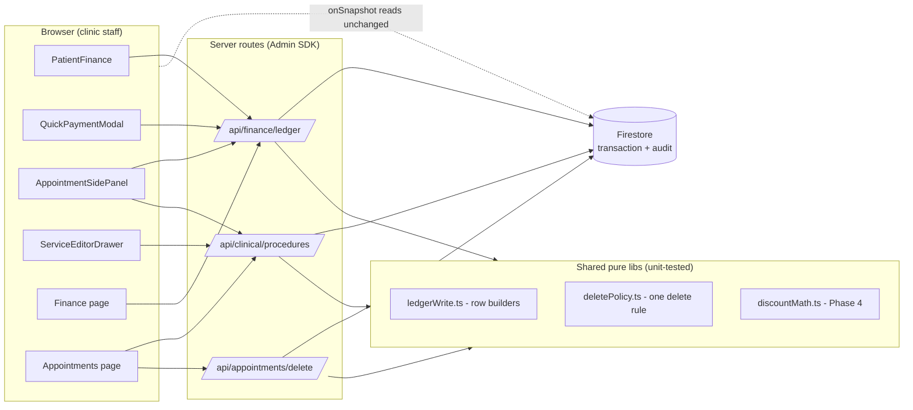

# Repair & Improvement Plan — Booking, Clinical, Ledger, Finance

Companion to `docs/blueprints/booking-clinical-finance.md` — **read that first**; it explains how
everything works today and anchors every claim to file:line. This document is the approved work
plan: what to change, in what order, and how to know each task is done.

Owner reviewed the findings and made the decisions recorded in §1 on 2026-08-22. An executing
session should treat those decisions as settled and the defaults in §9 as changeable-if-asked.

**Ground rules for the executor**

- Work phase by phase, in order. Within a phase, tasks are ordered by dependency.
- Every task ends with its named tests passing (`npm run test:*` scripts; add new ones where the
  task says so). Run `npm run lint` before each commit.
- Commit per task (or per small task group), descriptive messages, push to the designated branch.
- Do not widen scope: anything not in this plan goes in a "later" note, not in the diff.
- File:line anchors describe the code as of commit `eb90b60`; re-locate by symbol name if drifted.

---

## 1. Owner decisions (locked)

| # | Finding | Decision |
|---|---|---|
| 1 | Payments from side panel / AI carry no doctor, lab fee, or commission | Unify all payment writes on one builder. Historical repair MUST distinguish manually-corrected rows (some commission values were fixed by hand in the past) — never overwrite those; see P3.1 |
| 2 | Deleting an appointment orphans its clinical notes (query on never-written `lastAppointmentId`) | On delete, show a dialog asking what to do with the appointment's recorded services: delete them too, or keep them. No silent outcome. See P2.3 |
| 3 | Three delete doors, three different rules | One delete policy module, enforced everywhere. The strict rule wins: a procedure with payments cannot be deleted until its payments are deleted |
| 4 | Discounts are broken/dead; owner wants a real discount system | Full redesign: multiple price lists in settings, pick list when adding a service, per-list blanket discount %, discount editable everywhere, visible on receipt/ledger/finance. Includes the improvements listed in §8 (approved) |
| 5 | Reports guess the service from description text | Copy `serviceId` onto ledger procedure rows; reports group by id, fall back to text parsing for legacy rows |
| 6 | `finance.*` permissions are UI-only; any clinic member can write ledger directly | Do not trust staff. Money writes move behind server API routes with permission checks + audit trail; Firestore rules lock client writes to `ledger` (and narrow `clinical_notes`). Keep reads client-side so live screens stay fast |
| 7 | Note→ledger→backlink→appointment sync is 4 non-atomic writes | Merged into #6: the server route performs them in one Firestore transaction |
| 8 | `patients.balance` / `patients.totalSpent` written once, never maintained | Delete the fields from write sites; optional cleanup script |
| 9 | Conflict checks match dentist by display name | Match by `doctorId`, falling back to name for legacy rows |
| 10 | Reports load the entire ledger | Query by date range; default view = current month |
| 11 | `npm run test:permissions` points at a missing file | Fix it |

---

## 2. Target architecture

Today every screen writes Firestore directly. After Phase 2, **reads stay exactly as they are**
(onSnapshot, live), but **every money write goes through a server route** that checks the caller's
permission, performs the whole write as one transaction, and records an audit row.



Three invariants the routes enforce that nothing enforces today:

1. Every payment linked to a procedure carries full attribution: `doctorId`, `doctorName`,
   `doctorCommissionPercentage`, `doctorCommissionAmount`, `labFee`, `clinicProfit`.
   (Rule: commission exists only when the payment links a procedure that has a doctor. An
   unallocated/general payment legitimately carries none — that is now a stated rule, not an
   accident.)
2. A procedure (ledger row or billed clinical note) with attached payments cannot be deleted.
3. The note→ledger→backlink→appointment-services chain lands atomically or not at all.

---

## 3. Execution order

| Phase | Contents | Size | Depends on |
|---|---|---|---|
| 0 | Housekeeping: broken test script, vestigial fields, doctorId conflicts, ranged reports, serviceId on ledger rows | S–M | — |
| 1 | Shared money core: payment builder, delete policy (pure libs + tests) | M | — |
| 2 | Server write layer: 3 API routes, wire all UIs, tighten rules, audit trail | L | 1 |
| 3 | Historical repair of broken payments (dry-run classifier, manual-correction safe) | M | 2 |
| 4 | Price lists & discount engine | L | 2 |

Phase 3 runs after Phase 2 so no new broken rows are being created while old ones are repaired.
Rules deployment (P2.5) is the LAST step of Phase 2 — deploying it before the UIs are wired would
break every money screen.

---

## 4. Phase 0 — Housekeeping

### P0.1 Fix `npm run test:permissions`

**Why:** `package.json:16` runs `npx tsx tests/permissions.test.mts`, but the file does not exist
(verified; also absent from git history on this branch, and `src/lib/permissions.ts`, which the
`_comment_test_permissions` says it checks, does not exist either).

**Steps**
1. `git log --all --oneline -- tests/permissions.test.mts src/lib/permissions.ts` — if a deleted
   version exists on another branch, restore and adapt it.
2. Otherwise write a new `tests/permissions.test.mts` that does what the comment promises, against
   what exists today:
   - assert `getAllPermissionIds()` from `src/config/permissionsCatalog.ts` has no duplicates and
     every id matches `/^[a-z]+(\.[a-z]+)?$/`;
   - drift check: parse `firestore.rules` for the blanket-write exclusion list (the
     `subcollection != '…'` chain) and assert it contains every collection this plan expects to be
     excluded (after P2.5: `system_logs, staff, settings, ai_deletion_log, ai_pending_actions,
     message_drafts, sms_outbox, sms_devices, leads, ledger, clinical_notes, services,
     ledger_audit`). Before P2.5 lands, assert today's list; update the expectation in P2.5.
3. Update the `_comment_test_permissions` line to describe what the test now does.

**Done when:** `npm run test:permissions` passes and fails if someone removes an exclusion from
the rules.

### P0.2 Remove vestigial `patients.balance` / `patients.totalSpent`

**Why:** Written once at creation (`src/lib/bookingService.ts:134-135`, `src/lib/leads.ts:203-204`)
and never updated. Every real balance is derived from the ledger. A stale `balance: 0` on the
patient doc reads as authoritative and is a trap.

**Steps**
1. Delete both fields from the new-patient payload in `bookingService.saveBooking` and from the
   lead-conversion payload in `src/lib/leads.ts`. (`NewPatientModal.tsx:142` does not write them —
   verified — no change there.)
2. Grep for any reader: `grep -rn "\.balance\b\|\.totalSpent\b" src` — confirm no code reads the
   *patient-doc* fields (the blueprint already confirmed this; re-verify).
3. Optional cleanup script `scripts/strip-vestigial-patient-fields.mjs` (Admin SDK, follows the
   style of `scripts/*.mjs`): for each clinic, `FieldValue.delete()` the two fields where present.
   Ship the script; running it against production is the owner's call.

**Done when:** no write site mentions either field; grep in step 2 is clean.

### P0.3 Conflict checks match the dentist by `doctorId`

**Why:** `BookingModal.checkConflicts` (`src/components/BookingModal.tsx:522`) and the calendar
drag-drop check (`appointments/page.tsx:331`) query `where("doctor", "==", name)`. Renaming a
dentist makes their existing appointments invisible to conflict detection. `doctorId` already
exists on new appointments; legacy rows may have `doctorId: null`.

**Design:** query by **date only**, then filter in memory:
match when (`appt.doctorId && appt.doctorId === checkDoctorId`) OR
(`!appt.doctorId && normName(appt.doctor) === normName(checkDoctorName)`), where `normName`
trims/lowercases. A day's appointments are small; the in-memory filter is cheap and catches
legacy rows the id-only query would miss.

**Steps**
1. Add `checkDoctorId` parameter to `checkConflicts` (resolved in `handleSubmit` from the same
   `doctors` list the picker uses — the resolution already exists at `BookingModal.tsx:643`).
2. Same change in `appointments/page.tsx` `handleDrop` (resolve `nextDoctor` name → id via
   `doctorsList`).
3. `checkRoomConflict` already keys on `roomId` — no change.
4. Public availability (`src/lib/publicBooking.ts computeAvailableSlots:128`): the patient picks a
   dentist by *name*, so resolve that name to a staff id server-side inside
   `loadPublicClinicProfile`/`computeAvailableSlots` and apply the same id-or-legacy-name filter to
   the busy set.
5. Update the mirrored logic in `src/lib/automation/slotSuggestions.ts` if it filters by doctor
   name (check; align).

**Done when:** booking a slot for a renamed dentist (simulate: appointment with `doctorId` set but
stale `doctor` string) still triggers the conflict prompt. Add a small pure-function test if the
filter is extracted (recommended: `apptBlocksDoctor(appt, doctorId, doctorName)` in
`src/lib/appointmentTime.ts` or a new `src/lib/appointmentConflicts.ts`, unit-tested).

### P0.4 Reports query by date range, default to current month

**Why:** `reports/page.tsx:61` downloads the entire `ledger` (and `leads`) then filters in memory.
Cost and latency grow with clinic age. The finance page already does ranged queries on the same
`date` field — copy that pattern.

**Steps**
1. `ledger`: `query(getClinicCollection("ledger"), where("date", ">=", startDate), where("date", "<=", endDate))`.
   Keep the in-memory `status` filter. Rows whose `date` is missing fall out of ranged queries —
   acceptable (the current `normalizeDate(r.date || r.createdAt)` fallback only matters for
   malformed rows; note it in the commit message).
2. `leads`: range on `createdAt` `Timestamp` (`where("createdAt", ">=", Timestamp.fromDate(...))`).
   Single-field indexes are automatic; no composite needed (no orderBy on a second field).
3. `patients` and `staff`: keep full fetch (needed for new/returning classification and names;
   both are much smaller). Note as a future optimisation only.
4. Default range already is first-of-month → today (`getFirstDay()`); keep. The PDF export reads
   the on-screen snapshot, so it becomes month-bounded automatically.

**Done when:** switching the range refetches; a range covering one month reads only that month's
ledger (verify by console-logging snapshot size in dev, then remove the log).

### P0.5 Copy `serviceId` onto ledger procedure rows; reports group by id

**Why (decision #5):** the clinical note already resolves free text to price-list ids
(`serviceIds`, `ServiceEditorDrawer.tsx:242`), but the ledger row it writes
(`ledgerProcedureFields`, `:261`) carries only a composite `description`. Reports then reverse-
engineer the service from the string (`ClinicReport.tsx:57`, `revenueRecovery.ts:256`).

**Steps**
1. `ServiceEditorDrawer` `ledgerProcedureFields` += `serviceId: matchedServices[0]?.id || null`,
   `serviceIds: matchedServices.map(s => s.id)`, `serviceName: matchedServices[0]?.name || null`.
2. `bookingService.saveBooking` sessionProcedures ledger writes (both branches, `:230` and `:310`):
   thread `serviceId` through the `sessionProcedures` entries. Source: `BookingModal` builds them
   from `procServiceId` (`:1?` — the add-procedure block); add `serviceId` to the
   `{name, cost, addToLedger}` shape and to the `BookingSavePayload.sessionProcedures` type.
3. `AppointmentSidePanel` add-procedure ledger write (`:509`): include `serviceId: svc.id`,
   `serviceName: svc.name`.
4. Reports: in `ClinicReport`/`ServiceReport`/`SourceReport`, group income by
   `pay.serviceId → services name` when present; fall back to the existing description parsing
   for legacy rows. For payments, resolve serviceId **via the linked procedure row**
   (`pay.procedureId → procedure.serviceId`) rather than storing it on payments; build a
   `procedureById` map from the snapshot (the reports snapshot already loads procedures).
5. `revenueRecovery.findUnderpriced`: prefer `row.serviceId` lookup against the price list;
   keep `extractServiceLabel` as fallback.

**Done when:** a procedure billed through the note editor, through booking, and through the side
panel each produce a ledger row with `serviceId`; a report over a fixture with a *renamed* service
still attributes income correctly. Extend `tests/revenueRecovery.test.mjs` with one
serviceId-present fixture.

---

## 5. Phase 1 — Shared money core (pure libs + tests)

### P1.1 `src/lib/ledgerWrite.ts` — the one payment builder

**Why (decision #1):** four payment write paths exist; two skip attribution entirely (blueprint
§5.3). One builder, used by all, makes the correct row the only row anyone can write.

**Design** — pure, isomorphic (no Firebase imports; usable from client code today and from the
Phase 2 server routes):

```ts
export type StaffLite = { id: string; name: string; commissionPercentage?: number };
export type ProcedureLite = {
  id: string; doctorId?: string | null; doctorName?: string | null; doctor?: string | null;
  labFee?: number; description?: string;
};

/** Resolve the treating dentist for a payment: procedure.doctorId → staff by id → staff by name. */
export function resolveDoctorForPayment(
  procedure: ProcedureLite | null,
  staff: StaffLite[]
): StaffLite | null;

/**
 * Build a complete payment ledger row.
 * - `appliedLabFee` is passed in, NOT decided here: only the caller (inside a transaction, for
 *   the server) can know whether this is the procedure's first payment. Client callers pass the
 *   value from firstPaymentIdByProcedure/paidBefore; the server recomputes it inside the txn.
 * - commission math delegates to recalcCommissionFromPayment (lib/ledgerCommission.ts:70).
 * - a payment with no linked procedure or no resolvable doctor gets pct 0 / commission 0 /
 *   labFee 0 — the documented rule, not an omission.
 */
export function buildPaymentRow(args: {
  patientId: string; patientName: string;
  amount: number; method: string; description: string; date: string;
  procedure: ProcedureLite | null;
  appliedLabFee: number;
  staff: StaffLite[];
  actor: { uid: string; name: string };
  category?: string;               // "Treatment Payment" | "Advance Payment" | ...
}): Record<string, unknown>;       // the exact ledger document, minus serverTimestamp fields
```

Also export `buildManualEntryRow` for the finance page's income/expense form (type, amount/paid/
cost mapping per blueprint §2.3), so that shape is owned here too.

**Tests** — new `tests/ledgerWrite.test.mjs` (+ `"test:ledger": "npx tsx tests/ledgerWrite.test.mjs"`),
fixture style copied from `tests/paymentRecovery.test.mjs`:
- procedure with doctorId → full attribution, commission on `amount − labFee`;
- procedure with only a legacy `doctorName` → resolved via staff list;
- first payment gets labFee, second gets 0 (caller-supplied — test both calls);
- general payment (procedure null) → all commission fields present and zero, `procedureId: null`;
- amount 0 / negative → throws (caller validated, builder refuses).

**Done when:** tests pass. No call sites are switched yet (that is P2.4) — but
`aiPendingActions.ts:525` (already server-side) may be switched immediately as a first consumer.

### P1.2 `src/lib/deletePolicy.ts` — one delete rule

**Why (decision #3):** PatientFinance blocks deleting a paid procedure (`PatientFinance.tsx:657`),
the finance page warns then cascades anyway (`finance/page.tsx:289`), the clinical-notes delete
never checks (`clinical-notes/index.tsx handleDeleteService`). Owner chose: one rule, the strict
one, everywhere.

**Design** — pure:

```ts
export type DeleteTarget =
  | { kind: "ledger-procedure"; id: string }
  | { kind: "ledger-payment"; id: string }
  | { kind: "ledger-entry"; id: string }            // income | expense
  | { kind: "clinical-note"; id: string; ledgerIds: string[] };

export type DeleteVerdict = {
  allowed: boolean;
  reason?: "HAS_PAYMENTS";
  /** Everything that must be deleted together when allowed. */
  cascade: { collection: "ledger" | "clinical_notes"; id: string }[];
  /** Procedures whose payment set changed → resync lab fee/commission after (payment deletes). */
  resyncProcedureIds: string[];
};

export function evaluateDelete(target: DeleteTarget, related: {
  paymentsByProcedureId: Map<string, string[]>;       // procedureId → payment row ids
  ledgerRowsByClinicalNoteId: Map<string, string[]>;
}): DeleteVerdict;
```

Rules encoded:
- procedure (or note whose linked ledger rows include a procedure) with ≥1 payment → `allowed:
  false, reason: HAS_PAYMENTS`;
- payment → allowed; its `procedureId` goes in `resyncProcedureIds` (caller then runs
  `syncProcedureAndPaymentsFromClinicalNote` so the lab fee moves to the new first payment —
  exactly what `PatientFinance.handleDelete` does today at `:667`);
- income/expense → allowed, no cascade;
- clinical note → cascade = the note + all its linked ledger rows (both link directions, as
  `handleDeleteService` collects today), blocked if any of those rows has payments.

**Tests** — `tests/deletePolicy.test.mjs` (+ script `test:delete`): each rule above, plus the
finance-page scenario that today cascades through payments and must now be blocked.

**Done when:** tests pass. Call-site switching is P2.4.

---

## 6. Phase 2 — Server write layer (security + atomicity; decisions #6 + #7)

> ⚠️ Order inside this phase matters: routes (P2.1–P2.3) → wire UIs (P2.4) → deploy app → THEN
> tighten and deploy rules (P2.5). Deploying rules first bricks every money screen.

### P2.0 Extend `apiStaffAuth` with permission checks

`requireStaffUser` (`src/lib/apiStaffAuth.ts:40`) already verifies the token, loads the users doc
and resolves the clinic role — it just doesn't return `permissions` (a `string[]` on the users
doc, managed by UserManagement via `/api/admin/update-user`).

1. Return `permissions: string[]` (default `[]`) from `requireStaffUser`.
2. Add `requireStaffPermission(request, clinicId, permissionId)`: staff check, then
   `role === "Admin" || permissions.includes(permissionId)`; 403 with a clear message otherwise.
3. Route→permission map (server-enforced from here on):

| Action | Permission |
|---|---|
| create payment / income / expense | `finance.add` |
| edit any ledger row | `finance.edit` |
| delete any ledger row | `finance.delete` |
| create/update clinical procedure | `clinical.edit` (create also accepts Admin, and Dentist role implicitly — mirror the UI's rule in `navAccess`/`Protect`; check how `clinical.edit` is gated in the UI and match it exactly) |
| delete clinical procedure | `clinical.delete` |
| delete appointment (with or without services) | `appointments.delete` |

### P2.1 `/api/finance/ledger` — all ledger writes

`src/app/api/finance/ledger/route.ts`, POST with `action`:

- `create-payment` `{clinicId?, patientId, amount, method, description?, procedureId?}` —
  inside ONE transaction: read the procedure row (if linked), read its existing payments
  (`txn.get` on the query — Admin SDK supports queries in transactions), decide `appliedLabFee`
  via `firstPaymentIdByProcedure` semantics (**never trust a client-sent "first payment" flag**),
  read staff docs needed for resolution, then `buildPaymentRow` (P1.1) → create the payment row,
  update the procedure row's `paid` sum, and rewrite labFee/commission on sibling payments exactly
  as `syncProcedureAndPaymentsFromClinicalNote` does — port that helper's logic into a
  transaction-friendly server variant in `ledgerWrite.ts` or a new `src/lib/server/ledgerSync.ts`
  (the existing helper imports the *client* SDK and cannot be reused server-side as-is).
- `create-entry` `{type: "income"|"expense", amount, description, category, date, method,
  isRecurring?}` — via `buildManualEntryRow`.
- `update` `{id, patch}` — permission `finance.edit`; whitelist patchable fields per row type
  (payment: date/description/paid/method/discount-agnostic fields; procedure: the discount +
  description fields — Phase 4 extends this); recompute commission server-side exactly as
  `PatientFinance.handleUpdate` does today (`:424`), then run the sync when a payment linked to a
  procedure changed.
- `delete` `{id}` — permission `finance.delete`; load target + related rows, run
  `evaluateDelete` (P1.2); 409 `HAS_PAYMENTS` when blocked; on success delete the cascade in the
  txn and run resync for `resyncProcedureIds`.

Every action: `resolveUserClinicId` for tenancy (`src/lib/adminClinicDb.ts`), `logActivity`-style
`system_logs` entry (deletes at `severity: "HIGH"`, matching `finance/page.tsx:311`), and an audit
row (P2.6).

### P2.2 `/api/clinical/procedures` — the atomic note chain

`src/app/api/clinical/procedures/route.ts`, POST with `action`:

- `create` — the full `ServiceEditorDrawer.handleSave` new-note branch (`:350-363` +
  appointment-services sync `:365-400`) as ONE transaction: create ledger procedure row (when
  `addToLedger && cost > 0`), create note with `ledgerId`, set `clinicalNoteId` back on the row,
  patch `appointments.services[]` + `listPrice`/`cost` when an `appointmentId` is given. The
  request body carries what the drawer computes today (procedures, teeth, pricing fields, doctor,
  status, note text, date, appointmentId) — but the server **recomputes** `cost = unitCost ×
  pricingUnits`, lab fee, commission projection from the services + staff docs it reads itself;
  the client's numbers are display previews, not inputs of record.
- `update` — the edit branch (`:293-345`) in one transaction, including the
  add/remove-from-ledger toggle and the appointment sync.
- `delete` — permission `clinical.delete`; collect linked rows both directions (as
  `handleDeleteService` does), `evaluateDelete`, cascade or 409.
- `move` / `continue` — port `handleConfirmTransfer` (`clinical-notes/index.tsx`): `move` updates
  the note's `appointmentId` + `date` and the linked ledger rows' `date`; `continue` clones with
  zeroed cost and authorship stamps. Both must be server-side because after P2.5 the client can no
  longer write these collections.

Booking's `sessionProcedures` (both branches of `saveBooking`) call this route per procedure
instead of writing directly (see P2.4).

**Reused pieces:** all pure pricing/commission helpers (`utils.ts`, `ledgerCommission.ts`) are
Firebase-free and import cleanly server-side. Only the sync helper needs the server port noted in
P2.1.

### P2.3 `/api/appointments/delete` — guarded cascade with the services dialog (decision #2)

`src/app/api/appointments/delete/route.ts`, POST
`{appointmentId, servicesAction: "keep" | "delete"}`, permission `appointments.delete`.

Server flow (one transaction):
1. Read the appointment.
2. Collect its clinical notes — **the bug fix**: query `clinical_notes` by
   `where("appointmentId", "==", appointmentId)` (today's code queries the never-written
   `lastAppointmentId`, `bookingService.ts:429`), UNION the note ids referenced by
   `appointment.clinicalNoteId` and `appointment.services[].clinicalNoteId` (legacy links).
3. Collect ledger rows: `where("appointmentId", "==", appointmentId)` plus rows linked via the
   collected note ids (`clinicalNoteId in …`, chunked by 10 for Firestore `in` limits — or
   per-note queries).
4. Payment guard: any payment whose `procedureId` is one of the collected procedure rows →
   `servicesAction: "delete"` returns 409 `HAS_PAYMENTS`; `"keep"` proceeds.
5. `keep` → detach: set `appointmentId: null` on the notes and on their ledger rows (they keep
   their dates and stay visible — the general timeline bucket already renders detached notes,
   `ordering.ts:139`); delete the appointment.
   `delete` → delete notes + their ledger rows + the appointment.
6. `system_logs` entry + audit rows; response reports counts
   `{deletedNotes, detachedNotes, deletedLedgerRows}`.

Client (`appointments/page.tsx handleDeleteBooking:444` and the side panel's delete):
- before calling, load the appointment's notes (a read — still allowed) and show a dialog when
  any exist: list each service (name, cost, paid amount), with three choices —
  **Delete services too** (disabled, with explanation, when any service has payments),
  **Keep services** (default), **Cancel**. Arabic + English copy, matching the app's existing
  bilingual toast style.
- no notes → simple confirm as today, `servicesAction: "keep"`.
- `deleteBooking` in `bookingService.ts` is deleted (its callers now use the route); its
  `HAS_PAYMENTS` toast handling moves to the 409 handler.

### P2.4 Wire every write path to the routes

Switch list (each item: replace direct Firestore writes with a `fetch` to the route carrying
`Authorization: Bearer ${await auth.currentUser.getIdToken()}` — same pattern as the existing
`/api/whatsapp/owner-alert` calls in `appointments/page.tsx:373`):

| Call site | Route/action |
|---|---|
| `PatientFinance.handleAddPayment` (`:305`) | finance/ledger `create-payment` |
| `PatientFinance.handleUpdate` (`:424`) | finance/ledger `update` |
| `PatientFinance.handleDelete` (`:651`) | finance/ledger `delete` |
| `QuickPaymentModal.handleConfirmPayment` (`:150`, both branches) | finance/ledger `create-payment` |
| `AppointmentSidePanel.handleInlinePayment` (`:196`) | finance/ledger `create-payment` — **this is fragility #1's main fix**: the route resolves the doctor from the linked procedure |
| Finance page `handleSave` (`:250`) | finance/ledger `create-entry` / `update` |
| Finance page `handleDelete` (`:276`) | finance/ledger `delete` — behavior change: blocked (409) instead of warn-then-cascade when payments exist; surface the same "delete payments first" toast |
| `ServiceEditorDrawer.handleSave` (`:194`) | clinical/procedures `create` / `update` |
| `clinical-notes/index.handleDeleteService` | clinical/procedures `delete` |
| `clinical-notes/index.handleConfirmTransfer` | clinical/procedures `move` / `continue` |
| `AppointmentSidePanel` add-procedure block (`:509`) | clinical/procedures `create` |
| `bookingService.saveBooking` sessionProcedures loops (`:230`, `:310`) | clinical/procedures `create` per procedure, after the appointment write |
| `appointments/page.handleDeleteBooking` + side-panel delete | appointments/delete |
| `aiPendingActions` payment resolver (`:525`) | call `buildPaymentRow` + server sync directly (already Admin SDK — no HTTP hop) |

Unchanged on purpose: `handleReorder` (sortIndex-only note update — stays a direct client write
under the narrow rule in P2.5); all reads/onSnapshot; appointment create/update/status flows
(operational, not financial — accepted risk recorded in §9).

**Loading/UX:** each switched handler keeps its optimistic toasts but must await the route and
surface its error message (the routes return `{ok:false,error}` with proper status codes).

### P2.5 Tighten `firestore.rules` (+ rules tests) — deploy LAST

Additions (mirroring the file's existing style and its OR-composition warning — every newly
restricted collection must ALSO be added to the blanket-grant exclusion chain, or the override
does nothing):

```
// exclusion chain += 'ledger', 'clinical_notes', 'services', 'ledger_audit'

match /ledger/{rowId} {
  allow read: if isSuperAdmin() || hasClinicRole(clinicId);
  allow write: if false;                  // server-only via /api/finance + /api/clinical
}
match /ledger_audit/{entryId} {
  allow read: if isSuperAdmin() || hasClinicRole(clinicId);
  allow write: if false;
}
match /clinical_notes/{noteId} {
  allow read: if isSuperAdmin() || hasClinicRole(clinicId);
  // Drag-reorder is the one clinical write that stays client-side.
  allow update: if isSuperAdmin()
    || (hasClinicRole(clinicId) && isClinicActive(clinicId)
        && request.resource.data.diff(resource.data).affectedKeys().hasOnly(['sortIndex']));
  allow create, delete: if false;
}
match /services/{serviceId} {
  allow read: if isSuperAdmin() || hasClinicRole(clinicId);
  allow write: if isSuperAdmin() || (isClinicAdmin(clinicId) && isClinicActive(clinicId));
}
```

(`services` becomes Admin-write because Phase 4 makes the price list — including blanket
discounts — a pricing instrument; `PricingSettings` is already an admin-area screen, verified as
the only writer.)

Extend `tests/firestore.rules.test.mjs`: member cannot create/update/delete ledger rows; member
CAN update a note's `sortIndex` and CANNOT touch its `cost`; member cannot create notes; member
cannot write services; admin can write services; everyone with a role can still read all four.
Update P0.1's expected exclusion list. Run `npm run test:rules`.

**Deploy note for the owner:** ship the app first, then `firebase deploy --only firestore:rules`.

### P2.6 Audit trail for money rows

New subcollection `clinics/{clinicId}/ledger_audit` (server-written only — rules above):
`{action: "create"|"update"|"delete", collection: "ledger"|"clinical_notes", docId, before?,
after?, byUid, byName, byRole, via: "<route>/<action>", at: serverTimestamp}`.

Written by all three routes on every mutation (before/after snapshots on update/delete — the same
pattern as the existing `ai_deletion_log`). No UI this phase; the data existing is the deliverable.
Note in the code why deletes keep a `before` copy: it is what makes "who deleted this payment"
answerable.

---

## 7. Phase 3 — Historical repair of broken payments (decision #1, with manual-correction safety)

### P3.1 `scripts/repair-payment-attribution.mjs`

**Owner's constraint (verbatim intent):** some commission values were corrected *by hand* in the
past. The repair must never "fix" those back to formula values.

**Classifier** — every `type: "payment"` row in a clinic falls into exactly one class:

| Class | Condition | Action |
|---|---|---|
| `MANUAL_OR_OK` | `doctorCommissionAmount > 0` OR `doctorCommissionPercentage` is set (any value, including 0 set explicitly as a number) | **Never touched.** This is where hand corrections live; the script cannot distinguish them from correct rows and must not try |
| `AUTO_FIXABLE` | commission fields entirely absent, AND `doctorId`/`doctorName` absent, AND `procedureId` links a procedure that has a `doctorId` or `doctorName`, AND the fix is row-local (see below) | Recompute attribution + commission via `buildPaymentRow` inputs; stamp `attributionRepairedAt`, `attributionRepairedBy: "repair-script-v1"`; write a `ledger_audit` row |
| `REVIEW` | attributed (`doctorId` present) but commission fields absent while the staff doc has pct > 0; OR the fix would require touching another row's `labFee` (lab-fee firstness would shift onto/off a row outside this class) | Listed in the report for the owner; applied only via `--apply-reviewed <file>` after human approval |
| `UNRESOLVABLE` | no linked procedure, or the procedure names no doctor | Report only — matches the documented rule that unallocated payments carry no commission |

**Row-local rule (critical):** the script may only ever write the row being repaired. If applying
the lab-fee-on-first-payment rule to a repaired row would change which sibling payment carries the
lab fee (because a `MANUAL_OR_OK` sibling currently holds it), the row is downgraded to `REVIEW`.
Repairing one row must never silently change another.

**Modes**
- default `--dry-run --clinic <id>`: writes `repair-report-<clinic>-<date>.json` + a CSV
  (patientName, date, amount, class, currentFields, proposedFields) — nothing written to Firestore;
- `--apply --clinic <id>`: applies `AUTO_FIXABLE` only;
- `--apply-reviewed <csv> --clinic <id>`: applies approved `REVIEW` ids.

**Tests** — `tests/repairClassifier.test.mjs` (extract the classifier into
`src/lib/repairPaymentAttribution.ts` so it's importable): one fixture per class, including the
hand-corrected row (pct 40 stored where formula says 30 → untouched) and the lab-fee-shift
downgrade case.

**Done when:** dry run over the demo clinic (`scripts/seed-demo-clinic.mjs` data) produces a
sensible report; tests pass. Running `--apply` on production data is the owner's explicit go.

---

## 8. Phase 4 — Price lists & the discount engine (decision #4)

Owner's requirements: multiple price lists ("price pages") in settings; when adding a service for
a patient, choose the price list first; each list has a general button applying a blanket discount
% to all its services; discounts must be creatable and editable from every place a price appears;
the discount must show on the patient receipt, the ledger, and finance.

Included improvements (proposed by Claude, approved with "think and tell me" — flagged ⊕; every
default they introduce is listed in §9 and changeable):

- ⊕ **Structured discount fields everywhere, no more prose.** Today a discount edit rewrites the
  description string ("Before 500 → After 400") — `PatientFinance.tsx:419`. Structured fields make
  discounts reportable and editable without parsing.
- ⊕ **Patient default price list** — tag a patient once (e.g. "Insurance A"), every new service
  defaults to that list. Fewer wrong-price mistakes at the chair.
- ⊕ **Discount reason** — a small managed list (Promotion, Family & friends, Insurance, Staff,
  Complaint resolution, Other). Reports can then say *why* revenue was given away, which is the
  question the owner actually asks at month end.
- ⊕ **Discount authority cap** — non-admin staff can discount up to a configurable % (needs a
  reason above 0%); beyond the cap requires an Admin. Enforced server-side in the Phase 2 route,
  so it is a real rule, not a hidden button.
- ⊕ **The Discounts KPI becomes real** — the finance page's dead tile (blueprint fragility #3)
  gets computed from procedure rows in range *before* the cash filter drops them.
- ⊕ **Two explicit money rules, tested:** commission is calculated on the net (after-discount)
  amount; the lab fee is never discounted (the lab still charges full price).

Deferred (listed so nobody scope-creeps them in): time-limited campaign discounts with expiry;
per-branch price lists; discount approval workflow with notifications.

### P4.1 Data model

- `settings/price_lists` (settings doc → Admin-write already, after P2.5 also rules-enforced):
  `{ lists: [{ id, name, nameAr?, generalDiscountPercent: number, active: boolean,
  isDefault: boolean, createdAt }] }`. Seed on first read with
  `[{id: "standard", name: "Standard", generalDiscountPercent: 0, active: true, isDefault: true}]`.
- `services/{id}` gains `prices?: Record<listId, number>`; the existing `price` field IS the
  standard list's price (no migration needed — absent map entry falls back to `price`).
- `patients/{id}` gains `defaultPriceListId?: string`.
- `clinical_notes` + ledger procedure rows gain: `priceListId`, `priceListName`, `listPrice`
  (pre-discount total for the line), `discountMode: "none"|"percent"|"fixed"`,
  `discountValue: number|null` (the % or the fixed amount as entered), `discountAmount: number`
  (EGP), `discountReason: string|null`, and `cost`/`amount` become the **net**. (`listPrice` and
  `discountAmount` already exist on some appointment/ledger shapes — this makes them universal
  and authoritative.)
- `settings/discounts` (new settings doc): `{ reasons: string[], maxDiscountPercentNonAdmin:
  number|null }`.

### P4.2 `src/lib/discountMath.ts` — pure + tested

```ts
resolveListPrice(service, priceListId): number          // prices[listId] ?? price
applyDiscount(listTotal, mode, value): { discountAmount, net }   // rounding to 2dp, clamps
allowedDiscount(role, permissions, settings): { maxPercent: number|null }
```

Integration into the pricing chain (`ServiceEditorDrawer.handleSave` computation, moving
server-side in P2.2): `unitPrice = resolveListPrice(...)` → `listTotal = unitPrice ×
pricingUnits` → `{discountAmount, net} = applyDiscount(...)` → `cost = net` → lab fee from
catalog (NOT discounted) → commission on `net − labFee`. The blanket list discount is a
**prefill**: picking a service from a list with `generalDiscountPercent: 10` pre-fills a 10%
line discount, still visible and editable per line — which is what makes it show on receipts and
reports as a discount rather than silently as a lower price (owner's requirement).

`tests/discountMath.test.mjs` (+ script): percent/fixed/none; blanket prefill; commission-on-net;
labFee-undiscounted; cap enforcement (non-admin 25% attempt with cap 20 → rejected reason).

### P4.3 Server enforcement

`/api/clinical/procedures` `create`/`update` (from P2.2) accepts the discount fields, recomputes
`discountAmount`/`net` server-side, checks the cap against the caller's role/permissions
(`requireStaffPermission` machinery from P2.0), and requires a `discountReason` whenever
`discountAmount > 0` (any role). The finance `update` action accepts the same structured fields
for procedure rows and stops writing "Before → After" prose into descriptions (render that from
fields instead; keep `parseLedgerProcedureDescription` for legacy rows).

### P4.4 Entry-point UIs

Everywhere a service is picked gets the same two additions — a price-list select (default order:
note's stored list when editing → patient's `defaultPriceListId` → the clinic default) and a
discount editor (mode, value, reason; live "before / − discount / after" line):

1. `ServiceEditorDrawer` (mobile + `ChartWorkspace` inline form) — the main one.
2. `BookingModal` add-procedure block (sessionProcedures gain the discount fields → carried into
   the P2.2 route call).
3. `AppointmentSidePanel` add-procedure block.
4. `PatientFinance` edit modal — switch from its current ad-hoc discount math (`:424`) to the
   structured fields + route.
5. Patient profile (patients/[id] page) + `NewPatientModal`: the `defaultPriceListId` picker.

### P4.5 Settings UI

Extend `PricingSettings.tsx`:
- list manager (add/rename/activate/deactivate; cannot deactivate the default; delete only when
  no service has a price on it — otherwise deactivate);
- per-list price columns in the services grid (blank = falls back to standard);
- the **blanket discount** control per list: set `generalDiscountPercent` with a confirm dialog
  stating exactly what it does ("new services picked from this list will be pre-filled with an
  N% discount; existing recorded treatments are not changed");
- discount reasons editor + non-admin cap field (writes `settings/discounts`).

### P4.6 Surfaces

- **Receipt/PDF** (`receiptPdfHtml.ts`, `printPatientReceipt.ts`): per-procedure line shows list
  price, discount (amount + %), net; totals row already has `totalDiscount` — feed it from the
  structured fields. Reason stays internal (not printed).
- **WhatsApp statement** (`send-patient-message` route): same three numbers per line.
- **Finance page**: restructure the snapshot handler (`finance/page.tsx:139-170`) to keep
  procedure rows in range in a side array before the cash filter; `totalProcedureDiscounts` sums
  their `discountAmount` (status not deleted/cancelled). The tile (`:621`, `:665`) now shows real
  numbers — fixes blueprint fragility #3. Label it "Discounts granted (period)" (an accrual number,
  distinct from the cash KPIs — one-line tooltip explaining that).
- **Reports**: `ClinicReport` gains a small "Discounts by reason" table (sum of `discountAmount`
  grouped by `discountReason`, procedures in range).

**Done when:** a service picked from a 10%-list shows the prefilled discount at every entry point;
receipt, ledger row, finance tile and the reason table all show the same discount for a fixture
patient; a 30% discount by a non-admin with cap 20% is rejected by the server with a clear
message; all Phase 4 tests plus the full suite pass.

---

## 9. Defaults chosen (changeable), accepted risks, and out-of-scope

**Defaults** (owner can override any of these with one sentence):

| Setting | Default |
|---|---|
| Non-admin max discount | 20% (Admin unlimited); configurable in settings/discounts |
| Discount reasons seed | Promotion, Family & friends, Insurance, Staff, Complaint resolution, Other |
| Discount reason requirement | required whenever discountAmount > 0, all roles |
| Blanket list discount semantics | prefill of a per-line discount (visible, editable), never a hidden price change |
| `servicesAction` default in the appointment-delete dialog | "Keep services" |
| Repair script authority | dry-run by default; `--apply` only on explicit owner go |

**Accepted risks (recorded, deliberate):**
- `appointments` stay client-writable (status changes, booking edits). Financial truth lives in
  `ledger`/`clinical_notes`, which are locked; appointment `cost`/`services[]` are display
  mirrors. Locking appointments too would force the whole booking flow through APIs — not worth
  the workflow friction now.
- `patients`, `treatment_plans`, other operational collections keep the blanket member grant.
- Reports still full-fetch `patients` and `staff` (small collections).

**Out of scope for this plan:** campaign/expiry discounts, per-branch price lists, an audit-trail
viewer UI, approval workflows, appointments behind APIs.

---

## 10. Suggested execution prompts (for the next session)

1. "Read `docs/plans/repair-and-improvement-plan.md` and `docs/blueprints/booking-clinical-finance.md`, then execute Phase 0. Commit per task."
2. "Execute Phase 1." → 3. "Execute Phase 2 — stop before deploying rules and tell me." →
4. "Execute Phase 3 dry-run and show me the report." → 5. "Execute Phase 4."

New npm scripts expected by the end: `test:ledger`, `test:delete`, `test:repair`,
`test:discount` — plus the repaired `test:permissions`, extended `test:rules`, and the extended
`test:recovery`.

---

## 11. Execution record (completed 2026-08-22)

All five phases are implemented, tested and pushed to
`claude/booking-clinical-finance-blueprint-oylayc`. Verified at the end of each phase:
12 test suites green, `tsc --noEmit` clean, the production build compiling with all three new API
routes, and lint errors unchanged at the pre-existing baseline of 80.

| Phase | Commit | Notes |
|---|---|---|
| 0 | `35ae5c4`, `04f1751`, `832d2d5`, `8cdef4a`, `952c603` | Housekeeping |
| 1 | `e317ff0` | `ledgerWrite`, `deletePolicy` |
| 2 | `457df70`, `9383ceb`, `801b9b8` | Routes → UIs → rules, in that order |
| 3 | `6af22e4` | Repair classifier + script |
| 4 | `c8cd0fb`, `9ad6dec`, `6b00181` | Price lists and discounts |

### Found during execution, beyond the plan

- **`dashboard.view` was ungrantable.** Enforced by three AI screens and seeded by both signup
  routes, but missing from `PERMISSIONS_CATALOG` — so User Management, which renders its
  checkboxes from the catalogue, had no control for it. Added, and the new drift test is what
  caught it.
- **Four extra write sites** the plan had not listed: the patient timeline's delete, the side
  panel's session-procedure removal, and both dashboards' appointment delete. All switched.
- **Both dashboards swallowed delete errors** — a refused delete looked to the user like nothing
  had happened. They now surface the server's message.
- **`set-commission` route action.** The payout screen's manual split override wrote the ledger
  directly and recorded nothing about the figure having been chosen rather than computed. It now
  stamps `commissionSetManually`, which is what lets the Phase 3 classifier recognise a deliberate
  override. This screen is the most likely origin of the hand-corrected rows the owner asked to
  protect.
- **Procedure discount edits stayed on the finance route** rather than being pushed to the clinical
  route as §P2.1 suggested, so the patient-ledger edit modal kept working through Phase 2 instead
  of being broken for a phase. §P4.3 always intended the finance route to own those fields.

## 12. Go-live record (2026-08-23)

Shipped and verified in production, in this order. `docs/runbooks/go-live.md` holds the sequence
and the reasoning; this is what actually happened.

1. **App deployed.** Vercel had already built the merge commit as a *Preview*, so pushing the same
   SHA to `main` produced no Production build — Vercel reuses a build it has seen. Landing a fresh
   commit on `main` forced a genuine Production build. Promoting the Preview build instead would
   have been wrong here: Next.js inlines the seven `NEXT_PUBLIC_FIREBASE_*` values into the client
   bundle at build time, so a build carries whichever environment's Firebase config it was built
   under, wherever it is later served from.

2. **A real payment taken against the deployed app, before touching the rules.** This is what
   proved `/api/finance/ledger`, `/api/clinical/procedures` and `/api/appointments/delete` were
   actually serving. Publishing first would have denied the client its money collections while the
   routes might not have been reachable.

3. **Rules published**, then **a second payment taken** — confirming the denies did not break the
   path the first payment proved.

### The rules were not where this file thought they were

`firestore.rules` in this repo was **behind production, and on no branch**. The live ruleset carried
a granular-permissions layer written directly in the Firebase console and never committed:
`clinicPermissions`, `holdsPermission`, the `permCreate`/`permUpdate`/`permDelete` maps,
`memberMayWrite`, the `settings/counters` widening that lets a receptionist mint a patient file
number, the `ai_usage` denies, the staff self-profile and uid-claim blocks, and the read scoping on
`/users` and `/join_requests`.

Publishing this repo's file would have silently reverted all of it. What shipped instead is the
live ruleset with the money changes applied on top — verified additive, line by line.

**Two defects surfaced from that comparison, both pre-existing and neither caused by this work:**

- **`whatsapp_outbox` was writable by every clinic member.** Its own block said
  `allow create, delete: if false`, and that line did nothing: the collection was never held out of
  the blanket member-write grant, and rules OR together, so the general "staff may write" won. Any
  staff member could create a WhatsApp message to any number in the clinic's name. Now excluded.
  The browser only ever writes `status`/`sentAt`, which the narrow update rule still permits.

- **"Join an existing clinic" was failing for every user.** The live rules denied client-side
  `join_requests` create and pointed at `/api/join-requests/create`; that route had never been
  written, and the onboarding screen still wrote straight to Firestore. The route now exists and
  the screen posts to it — it validates the Clinic ID (a browser cannot: reading a clinic you hold
  no role in is denied, which is the very situation the request exists to resolve), takes the name
  and email from the Auth record rather than the form, and keys on `(uid, clinicId)` so a second
  press cannot file a duplicate.

The drift check in `tests/permissions.test.mts` had been pinned to `subcollection != '...'`, the
parameter name the exclusion chain carried before it moved into `memberMayWrite(clinicId, sub)`. It
matched nothing against the live shape and would have passed forever while the chain emptied out.
It now accepts both names, and asserts `whatsapp_outbox`, `ai_usage` and `ai_usage_log` alongside
the money collections.

**Standing lesson:** a rules edit made in the Firebase console must be pasted back into
`firestore.rules` and committed. This one was only recoverable because the live text happened to be
pasted into a chat; the next divergence may have no second copy.

### Still only the owner can run

1. **The historical repair, when you are ready.**
   ```
   node scripts/repair-payment-attribution.mjs --clinic <id>          # look, write nothing
   node scripts/repair-payment-attribution.mjs --clinic <id> --apply  # only after reading the report
   ```
   Dry run writes `repair-report-<clinic>-<date>.json` and `.csv`. Rows carrying any commission
   figure are never touched, and REVIEW rows are applied only from an approved list via
   `--apply-reviewed`.

   `scripts/strip-vestigial-patient-fields.mjs` is the same shape and equally optional.

2. **Check "Join an existing clinic" once, with a deliberately wrong Clinic ID.** It should answer
   *"No clinic has that ID"* rather than appearing to succeed. That flow has been broken long enough
   that nobody will report it fixed.

### Defaults now live, changeable in Settings → Services

Non-Admin discount ceiling 20%; reasons Promotion, Family & friends, Insurance, Staff, Complaint
resolution, Other; one "Standard" price list at full price, seeded on first read.
